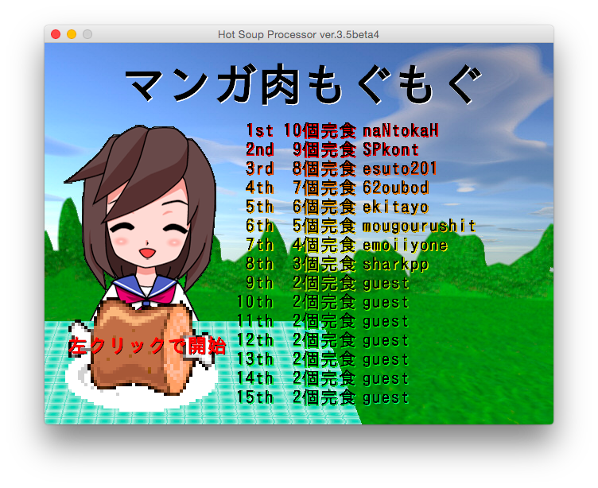
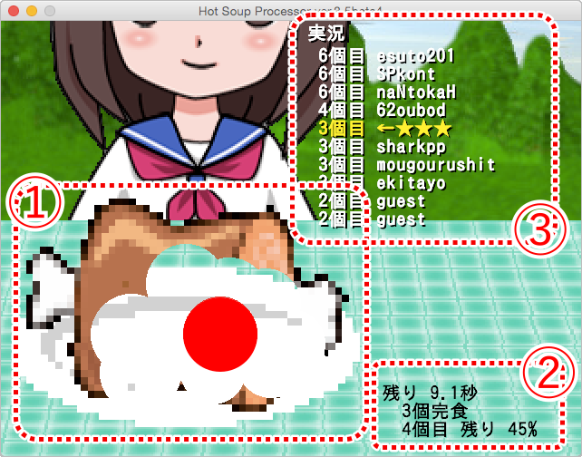

# マンガ肉もぐもぐ

[HSPプログラムコンテスト 2016](http://hsp.tv/contest2016/) 応募作品 [#1274](http://dev.onionsoft.net/seed/info.ax?id=1274)

「(有)テクノキット賞」入賞

## はじめに

あなたは、第13回マンガ肉大食い大会にエントリーしました！
制限時間は30秒！

マウスの左ボタンを押した状態でぐるぐると動かしてマンガ肉をもぐもぐしましょう♪

さらに、手に汗握る実況機能付きでランキング上位者と夢の対決が実現しました。

## 操作説明

1. **かの有名な“マンガ肉”。**
   マウスの左ボタンを押したままぐりぐりと消しゴムツールで消すように操作すると、お肉を[珠音ちゃん](http://hsp.tv/make/tamane2d.html)が食べます。
   マウスクリック時は赤色で塗りつぶされた円、クリックしていない時は赤色の単なる円でマウスの位置が表示されます。
2. **今の状態。**
  * 制限時間 30 秒の残りがどのぐらいあるか？
  * “マンガ肉”を幾つ食べ終えたか。
  * 今食べている“マンガ肉”の残りがどのぐらいか。
3. **実況中継**
   リアルタイムで、ランキングに登っているプレーヤとの比較が表示されます。
   `←★★★` の表示が今のランキングです。

## このゲームで遊びたい！

HSPプログラムコンテスト作品ページ [マンガ肉もぐもぐ](http://dev.onionsoft.net/seed/info.ax?id=1274) で作品について知ることができます。

この作品は「HSPTVブラウザ」で配信されています。

「HSPTVブラウザ」についてやダウンロードなどについては、
HSP公式ページの [HSPTVの紹介](http://hsp.tv/play/hsptv_br.html) からお願いします。

## ソースコードを利用する

1. スクリプトエディタで `main.hsp` を開く
2. <kbd>F5</kbd> で実行

## ライセンス

© 2016 sharkpp

このゲームのソースコードは [MIT ライセンス](LICENSE.ja-JP) の下で提供されています。

また、デバッグや実行ファイル生成時に mono氏作の `hsptvext.hsp` を利用しています。

また、このゲームが利用している、HSPTVフォルダ素材や、2D素材 "珠音（たまね）" については、それらを提供している [HSP](http://hsp.tv/make/begin.html) のライセンスに従います。
